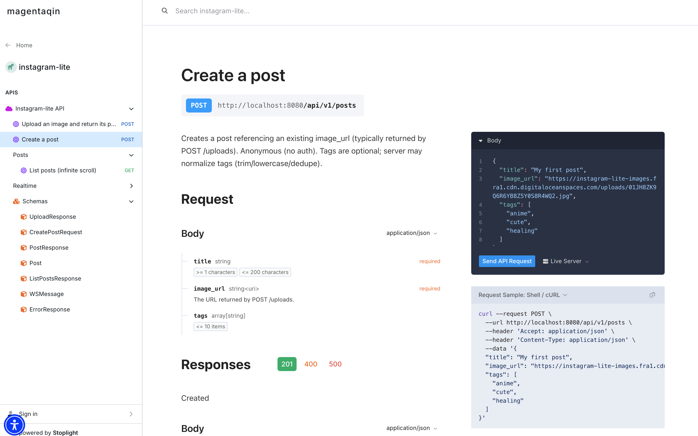

# Instagram Lite

A lightweight Instagram-like application with image uploads, post creation with tags, infinite scrolling feed, fuzzy tag search, and real-time updates via WebSocket.


---

## Features

### Core
- Create image-based posts with title and tags
- Upload images to object storage (DigitalOcean Spaces)
- Public post feed with infinite scrolling
- Cursor-based pagination (keyset pagination)
- Fuzzy tag search
- Real-time post updates via WebSocket (`post_created` events)

### Frontend
- React + Vite + Tailwind CSS
- Infinite scroll using `IntersectionObserver`
- Optimistic UI for post creation
- Debounced search input (300ms)
- WebSocket auto-reconnect logic

### Backend
- Go + Gin
- SQLite (simple, portable, deterministic)
- SQL-first approach (no ORM)
- Explicit transactions for post creation
- WebSocket hub with ping/pong keep-alive
- Auto-run migrations on startup

---

## Architecture Overview

### Project Structure

```
instagram-lite/
├── backend/                    # Go backend (API + WebSocket)
│   ├── config/                 # App configuration (DB, env, migrations)
│   ├── internal/
│   │   ├── handlers/           # HTTP & WebSocket handlers
│   │   │   ├── posts.go        # Create post handler
│   │   │   ├── posts_list.go   # List posts (cursor pagination + tag filter)
│   │   │   ├── uploads.go      # Image upload handler
│   │   │   └── ws.go           # WebSocket entrypoint
│   │   ├── imageproc/          # Image processing (resize, crop)
│   │   ├── realtime/           # WebSocket hub (clients, broadcast, pumps)
│   │   └── storage/            # Storage abstraction (DigitalOcean Spaces)
│   ├── migrations/             # SQL migrations (schema + seed)
│   │   ├── 001_init.sql
│   │   └── 002_seed.sql
│   ├── routes/                 # HTTP route registration
│   ├── main.go                 # Application entrypoint
│   ├── openapi.yaml            # API documentation
│   ├── Dockerfile              # Backend Docker image
│   ├── .env                    # Local environment variables
│   └── instagram.db            # SQLite database (local/dev only)
│
├── frontend/                   # React frontend (Vite + Tailwind)
│   ├── public/
│   ├── src/
│   │   ├── components/         # UI components (Feed, Modal, Upload)
│   │   ├── assets/
│   │   ├── App.jsx             # Root component
│   │   ├── main.jsx            # React entrypoint
│   │   ├── index.css           # Tailwind entry
│   │   └── App.css
│   ├── index.html
│   ├── vite.config.js
│   ├── tailwind.config.js
│   ├── postcss.config.js
│   └── package.json
│
├── docs/                       # Documentation assets
│   ├── demo.png                # Demo screenshot / GIF
│   └── stoplight.png           # API preview
│
├── Makefile                    # Local dev helpers
├── docker-compose.yml          # Full-stack local setup
├── .gitignore
└── README.md
```

### API Design

All APIs are documented in `backend/openapi.yaml`. View the interactive documentation at:
https://magentaqin.stoplight.io/docs/instagram-lite/1c29461544425-create-a-post



---

## Running the Project

### Prerequisites

- Go >= 1.21
- Node.js >= 22.12.0
- npm
- make

### Install Dependencies

```bash
make install
```

This installs frontend dependencies and downloads backend Go modules.

### Configure Environment Variables

Backend loads `backend/.env` automatically. Image uploads use DigitalOcean Spaces, so configure these variables before running:

```bash
S3_ENDPOINT=...
S3_REGION=...
S3_BUCKET=...
S3_ACCESS_KEY=...
S3_SECRET_KEY=...
S3_PUBLIC_URL=...
```

### Run Frontend + Backend

```bash
make dev
```

Services will be available at:

- **Frontend**: http://localhost:5173
- **Backend API**: http://localhost:8080

---

## Database & Migrations

- **SQLite database**: `instagram.db`
- All migrations and seed data run automatically on backend startup

---

## Technical Details

### 1. Upload and Post Creation (Intentionally Split)

- **`POST /uploads`** — Handles image upload, processing, and storage. Returns a processed, public image URL.
- **`POST /posts`** — Creates a post referencing an existing image URL. Triggers a WebSocket broadcast (`post_created`).

**Why split them?**

This mirrors real-world systems:

- Media processing is **CPU/IO heavy** and can fail independently
- Post creation is a **small transactional DB write**
- Users get **early feedback** if upload fails, before submitting metadata
- Tail latency is reduced for post creation
- Media storage and business databases are often separate services

This separation keeps post publishing fast, reliable, and easy to reason about.

### 2. Feed & Pagination

**Infinite Scroll**
- Implemented using `IntersectionObserver`
- Backend uses **cursor-based pagination** (keyset pagination)
- Ordering key: `(created_at, id)`

**Why not offset pagination?**
- Stable ordering
- No duplicates or missing records
- Better behavior for infinite scroll feeds

### 3. Tag Search (Fuzzy Filter)

- Backend supports fuzzy tag matching using `LIKE %tag%`
- Frontend sends `?tag=...` query
- Tags are normalized (trim, lowercase, dedupe)

### 4. Real-time Updates (WebSocket)

**Why no server-side filtering per query?**

- WebSocket subscriptions tied to arbitrary search queries add complexity
- For this homework, **simplicity and correctness** matter more than over-optimization
- Frontend applies lightweight filtering to incoming events when a search query is active

This avoids surprising UX cases like:
> User searches for `nature`, but WebSocket pushes unrelated `anime` posts.

### 5. Frontend Feed Strategy

The feed merges two data sources:

1. **HTTP API** — Initial load and pagination (`cursor`)
2. **WebSocket** — Real-time `post_created` events

**How they are reconciled:**

- Initial list comes from REST
- New posts are **prepended** to the feed
- If a search query is active, incoming WebSocket posts are filtered client-side
- Cursor pagination remains consistent

This keeps the mental model simple and avoids server-side subscription state.

### 6. Why No Virtualized List?

Virtualized lists (e.g. `react-window`) are **not necessary for this homework**.

**When virtualization is needed:**
- Thousands of items rendered at once
- Complex card layouts
- Heavy DOM / memory usage

Virtualization is documented as future work.

---

## Future Work

- **Advanced Tag Search**
  - Support multiple tag queries
  - Move fuzzy matching to a more efficient indexed strategy if data grows

- **Feed Performance**
  - Add list virtualization (e.g. `react-window`) when feed size becomes large
  - Improve scroll performance for heavy DOM trees

- **WebSocket Filtering**
  - Push query-aware updates (e.g. per-tag subscriptions)
  - Reduce client-side filtering for real-time events

- **Media Pipeline**
  - Clean up orphaned uploads in S3 bucket if post creation fails
  - Add background jobs for image processing and cleanup

- **Testing**
  - Add frontend integration tests (e.g. Playwright)
  - Expand backend tests for WebSocket and pagination logic

- **Security**
  - Restrict WebSocket `Origin` checks in production
  - Add rate limiting for uploads and post creation

- **Observability**
  - Add structured logging for WebSocket events
  - Track latency for upload and feed endpoints
